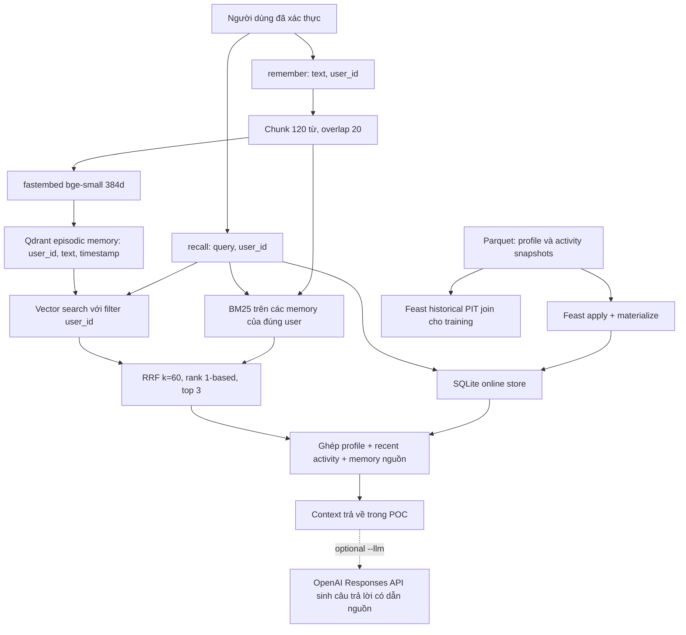

# Hybrid Memory Agent — Lê Văn Sang, K4 Track 2

## Mục tiêu và luồng dữ liệu

Trợ lý phục vụ người dùng Việt Nam cần nhớ cả nội dung đã đọc lẫn thuộc tính
ổn định của người dùng. Hai loại dữ liệu có cách truy cập khác nhau: câu hỏi
“tôi đã đọc gì về Kubernetes?” cần truy xuất những đoạn văn liên quan; câu
hỏi “tôi nên đọc gì tiếp?” cần thêm ngôn ngữ ưu tiên, chủ đề quan tâm và tốc độ
đọc. Thiết kế này dùng Qdrant cho episodic memory, Feast cho hồ sơ và hoạt động.
POC trả về context có nguồn để một LLM sử dụng ở bước tiếp theo.

`remember()` phân đoạn, tạo embedding, ghi điểm cùng payload vào Qdrant, sau
đó cập nhật tập memory cục bộ cho BM25. `recall()` lấy profile từ Feast, chỉ
xếp hạng memory thuộc user yêu cầu, rồi ghép hai danh sách bằng RRF. Ngày giờ
ghi nhớ dùng UTC để không nhầm lẫn giữa thời gian của server và Việt Nam.
Demo mặc định in năm context. Chế độ tùy chọn `python bonus/demo.py --llm`
dùng `bonus/llm.py` để gọi OpenAI Responses API bằng `gpt-4.1-mini` hoặc model
trong `OPENAI_MODEL`, sau đó in câu trả lời tiếng Việt và token usage. API key
được đọc từ môi trường hoặc `.env`, không ghi vào log. Request đặt `store=false`
để tắt lưu response qua tùy chọn API, không đồng nghĩa cam kết zero retention.
Chỉ dữ liệu tổng hợp trong demo được sử dụng cho lần chạy minh chứng này.
Prompt yêu cầu coi memory là dữ liệu, nêu thiếu thông tin và dẫn ID nguồn;
đây là biện pháp giảm rủi ro, không bảo đảm chống mọi prompt injection.

## Quyết định 1: phân đoạn và truy xuất

Chọn đoạn 120 đơn vị tách theo khoảng trắng, chồng lấn 20 đơn vị, thay vì lưu
toàn bộ cuộc hội thoại vào một vector. Đoạn ngắn giúp câu hỏi về autoscaling
không bị pha loãng bởi nội dung unrelated trong cùng cuộc trò chuyện. Overlap
giữ phần kết nối giữa hai đoạn, nhưng tăng số vector và có thể đưa hai đoạn
tương tự vào top kết quả. Với đoạn dài 1.000 đơn vị, chi phí lưu và embedding
tăng so với một vector; đổi lại context window không phải chứa toàn bộ lịch sử.

Lựa chọn semantic chunking theo ranh giới ý nghĩa có thể cải thiện chất lượng,
nhưng cần tokenizer hoặc mô hình bổ sung và khó tái lập trong môi trường Lite.
Trong POC, whitespace đơn giản, dễ kiểm tra; “120 từ” không tương đương 120 token
của mô hình, đây là giới hạn được ghi rõ. Production nên đo độ dài token thực,
lọc trùng đoạn và đánh giá theo truy vấn tiếng Việt trước khi đổi chiến lược.

BM25 giữ tín hiệu tên Kubernetes, IAM, API hoặc mã lỗi; vector hỗ trợ diễn đạt
lại. RRF dùng thứ hạng thay vì cộng điểm thô khác thang đo, với k=60 và rank
bắt đầu từ 1. Mỗi retriever lấy tối đa 50 ứng viên, context chỉ nhận top 3.
Ngân sách này đánh đổi độ phủ với kích thước context và chi phí sinh câu trả lời.

## Quyết định 2: schema feature và ranh giới người dùng

Profile dùng entity `user`, join key `user_id`, gồm `reading_speed_wpm` kiểu
Int64, `preferred_language` và `topic_affinity` kiểu String. Source là Parquet,
Feature View có TTL 30 ngày. Recent activity dùng cùng entity với hai trường
Int64 `queries_last_hour` và `distinct_topics_24h`, TTL một giờ. NB4 còn đăng ký
item popularity với entity `item`, key `doc_id`, TTL 24 giờ; khóa này khớp corpus
để có thể mở rộng thành reranker dựa trên tương tác tài liệu.

Chọn feature dạng bảng thay vì vector sở thích tiềm ẩn vì giá trị dễ giải thích,
dễ kiểm thử và có thể dùng cùng schema cho online lookup lẫn PIT training join.
Đổi lại, một `topic_affinity` đơn lẻ không biểu diễn đầy đủ người dùng quan tâm
nhiều lĩnh vực. Production có thể thêm phân phối trọng số chủ đề, nhưng cần
quy tắc tính từ lịch sử và kiểm chứng training-serving skew.

Memory giữ `user_id`, text và `created_at`; Qdrant lọc user trước khi trả ứng viên.
BM25 cũng chỉ xây trên memory của đúng user. Lọc sau top-k có thể vừa giảm recall
vừa làm dữ liệu người khác lọt vào context; vì vậy tenant boundary đặt trước fusion.
Demo ghi một memory riêng của u_002 và xác nhận cả năm context u_001 không chứa nó.
Trong API thật, `user_id` phải lấy từ phiên xác thực, không tin chuỗi do client gửi.

## Quyết định 3: độ tươi, TTL và tính đúng thời gian

Nội dung user vừa ghi nhớ phải truy xuất được ngay sau khi upsert thành công;
đây là use case cần độ tươi dưới một giây trong thiết kế production. POC ghi
đồng bộ trong cùng tiến trình, không có hàng đợi, nên `recall()` tiếp theo thấy
memory ngay. Độ trễ thực vẫn phụ thuộc thời gian embedding và dung lượng văn bản.

Recent activity phục vụ nhận biết chủ đề đang quan tâm cần cập nhật khoảng một
đến năm phút, hoặc streaming Push API nếu yêu cầu khắt khe. Hồ sơ ngôn ngữ và
tốc độ đọc có thể cập nhật hàng ngày vì thay đổi chậm. Chỉ số item popularity
phục vụ reranking có thể làm mới hàng giờ. Ba nhịp này giảm chi phí vận hành so
với cập nhật mọi feature sau từng query, đồng thời tránh dùng profile quá cũ.

TTL không tự chạy job cập nhật và không đồng nghĩa mọi online value đều tự
biến mất ngay lúc hết hạn. Thiết kế production cần lịch materialize, timestamp
nguồn, giám sát freshness và chính sách khi dữ liệu quá cũ. POC dùng dữ liệu
tổng hợp được materialize trong NB4; recent activity in ra là snapshot, không
phải bộ đếm được cập nhật bởi `remember()`. Không mô tả snapshot này là streaming.

Khi tạo dữ liệu training, Feast PIT join chọn phiên bản hợp lệ gần nhất trước
hoặc bằng thời điểm sự kiện, trong TTL. NB4 cố tình tạo hồ sơ u_001 có giá trị
187 ở sau sự kiện, còn hồ sơ trước đó là 177: PIT trả 177, online trả 187. Điều
này kiểm chứng không dùng tương lai, thay vì chỉ kiểm tra số dòng DataFrame.

## Phương án bị bác bỏ và ngữ cảnh tiếng Việt

Không lưu toàn bộ hội thoại vào một feature String trong Feast. Feature lookup
theo entity phù hợp lấy thuộc tính đã biết, không thay thế chỉ mục similarity.
Hội thoại tăng liên tục, có nhiều đoạn cùng user, cần chunking và ranking; ép
vào một ô feature làm payload lớn, mất khả năng truy xuất theo ý nghĩa và gây
khó khăn khi đổi embedding model. Qdrant và Feast có chu kỳ cập nhật khác nhau.

Tiếng Việt có code-switching: “scale pod theo traffic”, “cloud security” hoặc
“giảm bill AWS”. BM25 whitespace xử lý thuật ngữ tiếng Anh khá rõ, nhưng tách
âm tiết tiếng Việt làm mất đơn vị như “điện toán đám mây”. Có thể dùng underthesea
hoặc pyvi, đánh đổi dependency và độ trễ với độ chính xác tách từ. Không bỏ dấu
toàn bộ text vì làm nhập nhằng nghĩa. Lỗi Telex như “tooi”, “ddam maay” cần lớp
chuẩn hóa có đánh giá và lưu bản gốc để không làm hỏng mã lệnh hoặc tên riêng.

bge-small-en-v1.5 chủ yếu huấn luyện tiếng Anh; NB2 của Lite đo semantic paraphrase
24%, thấp hơn BM25 33,3%. Khi dùng bge-m3 đa ngữ phải đổi dimension, embed lại và
đo chất lượng/latency, không tái sử dụng vector 384 chiều hoặc cache cũ.

## Giới hạn POC và cách chạy

POC chưa có xác thực, mã hóa lưu trữ, CRUD memory, lưu bền sau restart, đồng bộ
nhiều thiết bị hay cập nhật activity thực. RAM Qdrant và dict BM25 cần cùng vòng
đời; lỗi tiến trình làm mất episodic memory. Production cần durable ingestion,
idempotency, chính sách xóa dữ liệu và kiểm thử privacy. Chạy NB4 trước, sau đó
`python bonus/demo.py` bằng Python trong venv. Demo có năm truy vấn, Feast thật,
memory theo user và assertion ngăn rò chéo; kết quả nằm trong `submission/logs/`.
